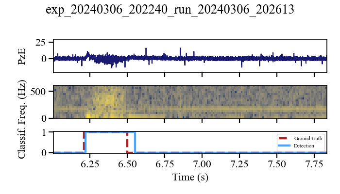
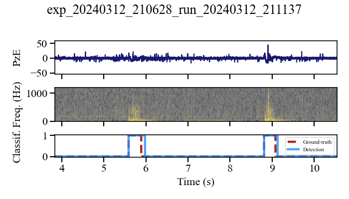

# Tactile slip detection demo (PzE sensors)

Minimal demo for spectro-temporal slip detection in robotic manipulation using tactile PzE signals (FFT + GRU).

## Run

```bash
# 1) Create + activate venv
python -m venv .venv

# Windows
.venv\Scripts\activate

# Linux / macOS
# source .venv/bin/activate

# 2) Install deps
pip install -r requirements.txt

# 3) Run inference + plots
python demo_infer_clean.py
```


<p align="center">
  
  
</p>


The repo is about 30Mo.
This includes a small demo dataset for inference.
(It takes 5 min to download, install dependencies and run.)


